# ESP Board Manager 技术文档

***

## 1. 组件架构概述

### 1.1 系统框图

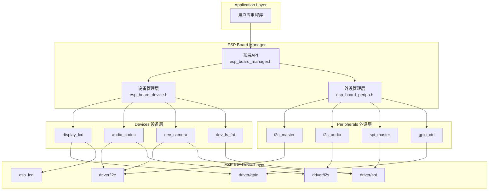

### 1.2 核心设计理念

**设备 (Device) vs 外设 (Peripheral) 的分离**

- **外设 (Peripheral)**：总线型基础资源，如 I2C、I2S、SPI、GPIO 等
  - 具有类型 (type) 和角色 (role)
  - 可以被多个设备共享复用
  - 例如：`i2c_master`、`i2s_audio_out`、`gpio_pa_control`
- **设备 (Device)**：具体功能模块，如音频编解码器、LCD 显示屏、摄像头等
  - 依赖一个或多个外设
  - 通常包含特定芯片 (chip) 的驱动配置
  - 例如：`audio_dac` (ES8311)、`display_lcd` (EK79007)

### 1.3 配置驱动的生成流程

#### 阶段1：开发板配置

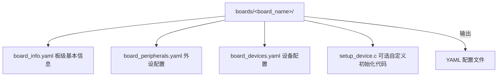

#### 阶段2：代码生成 (CMake阶段)

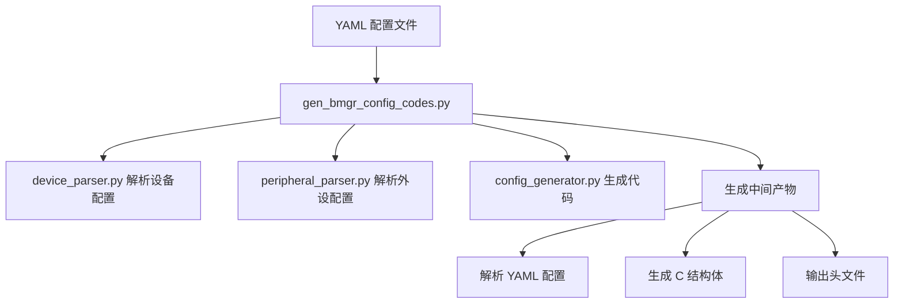

#### 阶段3：编译阶段

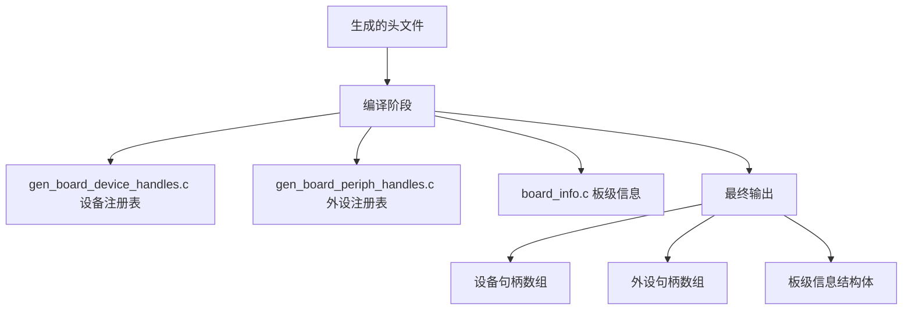

***

## 2. 核心数据结构

### 2.1 设备相关结构体

```c
// 设备描述符 (定义阶段，由生成器产生)
typedef struct esp_board_device_desc {
    const struct esp_board_device_desc *next;    // 链表 next 指针
    const char *name;                           // 设备名称 (如 "audio_dac")
    const char *chip;                           // 芯片型号 (如 "es8311")
    const char *type;                           // 设备类型 (如 "audio_codec")
    const char *sub_type;                       // 子类型 (如 "dsi", "spi")
    const void *cfg;                            // 配置数据指针
    uint16_t cfg_size;                          // 配置数据大小
    uint8_t init_skip : 1;                      // 跳过自动初始化标志
    const char *power_ctrl_device;               // 电源控制设备名
} esp_board_device_desc_t;

// 设备句柄 (运行时管理)
typedef struct esp_board_device_handle {
    struct esp_board_device_handle *next;        // 链表 next 指针
    const char *name;                           // 设备名称
    const char *chip;                           // 芯片型号
    const char *type;                          // 设备类型
    void *device_handle;                        // 设备-specific 句柄
    uint8_t ref_count;                         // 引用计数 (用于管理初始化/去初始化)
    esp_board_device_init_func init;            // 初始化函数指针
    esp_board_device_deinit_func deinit;        // 去初始化函数指针
} esp_board_device_handle_t;
```

### 2.2 外设相关结构体

```c
// 外设描述符 (定义阶段)
typedef struct esp_board_periph_desc {
    const struct esp_board_periph_desc *next;   // 链表 next 指针
    const char *name;                           // 外设名称 (如 "i2c_master")
    const char *type;                           // 外设类型 (如 "i2c")
    esp_board_periph_role_t role;               // 角色 (如 MASTER/SLAVE)
    const char *format;                         // 数据格式 (如 "std-out")
    const void *cfg;                            // 配置数据指针
    int cfg_size;                               // 配置数据大小
    int id;                                     // ID (从名称中提取，如 gpio48 -> 48)
} esp_board_periph_desc_t;

// 外设条目 (运行时管理)
typedef struct esp_board_periph_entry {
    struct esp_board_periph_entry *next;        // 链表 next 指针
    const char *type;                           // 外设类型
    esp_board_periph_role_t role;               // 角色
    esp_board_periph_init_func init;            // 初始化函数
    esp_board_periph_deinit_func deinit;        // 去初始化函数
} esp_board_periph_entry_t;

// 外设列表节点 (运行时实例)
typedef struct esp_board_periph_list {
    struct esp_board_periph_list *next;         // 链表 next 指针
    const char *name;                           // 外设名称
    const char *type;                           // 外设类型
    esp_board_periph_role_t role;               // 角色
    void *periph_handle;                        // 外设-specific 句柄
    uint8_t ref_count;                          // 引用计数
} esp_board_periph_list_t;
```

### 2.3 板级信息结构体

```c
// 板级信息 (定义在 board_info.yaml)
typedef struct esp_board_info {
    const char *name;           // 板子名称 (如 "esp32_p4_function_ev")
    const char *chip;           // 芯片型号 (如 "esp32p4")
    const char *version;        // 版本号 (如 "1.0.0")
    const char *description;    // 描述
    const char *manufacturer;   // 制造商
} esp_board_info_t;
```

### 2.4 初始化函数类型定义

```c
// 设备初始化函数类型
typedef int (*esp_board_device_init_func)(void *cfg, int cfg_size, void **device_handle);

// 设备去初始化函数类型
typedef int (*esp_board_device_deinit_func)(void *device_handle);

// 外设初始化函数类型
typedef esp_err_t (*esp_board_periph_init_func)(void *cfg, int cfg_size, void **periph_handle);

// 外设去初始化函数类型
typedef esp_err_t (*esp_board_periph_deinit_func)(void *periph_handle);
```

***

### 2.5 esp_board_entry 静态注册机制

`esp_board_entry.h` 提供了一套**静态注册机制**，核心用途是实现设备/外设的**自动发现和子类型分发**。

#### 2.5.1 核心用途

**1. 设备子类型分发**

允许同一种设备类型（如 `display_lcd`）支持多种接口实现（DSI、SPI、RGB），通过 `sub_type` 字段动态选择：

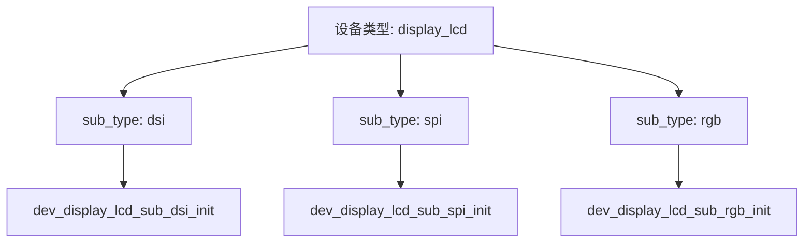

**2. 配置驱动的设备实例化**

通过 YAML 配置中的名称自动找到对应的实现，无需手动注册：

```yaml
# board_devices.yaml
devices:
  - name: lcd_panel
    type: display_lcd
    sub_type: dsi  # 通过此字段选择具体实现
```

#### 2.5.2 实际调用流程

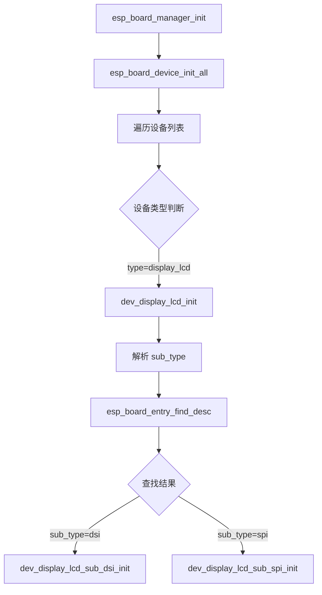

**调用链示例**：

| 步骤 | 函数 | 说明 |
|------|------|------|
| 1 | `dev_display_lcd_init` | LCD 设备主入口 |
| 2 | `esp_board_entry_find_desc("dsi")` | 根据 sub_type 查找实现 |
| 3 | `dev_display_lcd_sub_dsi_init` | DSI 接口具体实现 |

#### 2.5.3 典型应用场景

**场景1：同设备多接口支持**

```c
// DSI 接口实现
ESP_BOARD_ENTRY_IMPLEMENT(dsi, dev_display_lcd_sub_dsi_init, dev_display_lcd_sub_dsi_deinit);

// SPI 接口实现
ESP_BOARD_ENTRY_IMPLEMENT(spi, dev_display_lcd_sub_spi_init, dev_display_lcd_sub_spi_deinit);
```

**场景2：摄像头设备适配**

```c
// SPI 摄像头
ESP_BOARD_ENTRY_IMPLEMENT(camera_spi, dev_camera_sub_spi_init, dev_camera_sub_spi_deinit);

// MIPI 摄像头
ESP_BOARD_ENTRY_IMPLEMENT(camera_mipi, dev_camera_sub_mipi_init, dev_camera_sub_mipi_deinit);
```

#### 2.5.4 设计优势

| 优势 | 说明 |
|------|------|
| **配置驱动** | 修改 YAML 即可切换接口实现，无需改代码 |
| **零运行时注册** | 编译期完成注册，无需调用注册函数 |
| **模块化扩展** | 新增接口只需添加 `.c` 文件和注册宏 |
| **编译优化** | 未使用的实现可被链接器自动丢弃 |
| **类型安全** | 编译期检查函数签名 |

#### 2.5.5 核心数据结构

```c
typedef struct {
    const char                     *entry_name;  /*!< 条目名称（匹配 YAML 的 sub_type）*/
    esp_board_entry_init_func_t    init_func;    /*!< 初始化函数指针 */
    esp_board_entry_deinit_func_t  deinit_func;  /*!< 去初始化函数指针 */
} esp_board_entry_desc_t;
```

#### 2.5.6 注册宏与查找函数

**注册宏**：

```c
#define ESP_BOARD_ENTRY_IMPLEMENT(name, init_func_entry, deinit_func_entry)     static const esp_board_entry_desc_t __attribute__((section(".esp_board_entries_desc"), used))     esp_board_entry_##name = {         .entry_name = #name,         .init_func = init_func_entry,         .deinit_func = deinit_func_entry     }
```

**查找函数**：

```c
// 通过名称查找注册的条目
static inline const esp_board_entry_desc_t *esp_board_entry_find_desc(const char *entry_name);

// 列出所有已注册的条目（调试用）
static inline void esp_board_entry_list_all(void);
```

#### 2.5.7 工作原理简述

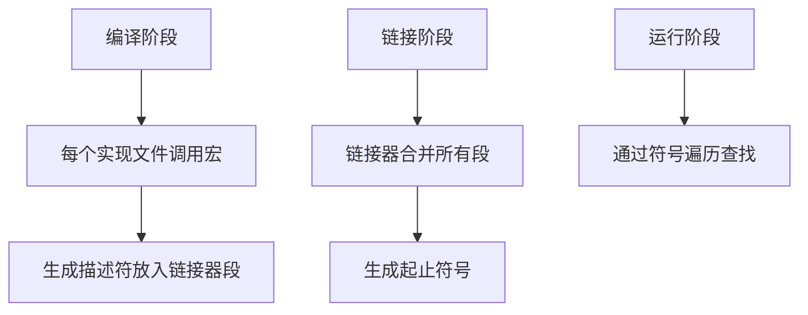

该机制利用**链接器段技术**，在编译期将所有设备实现注册到特殊段中，运行时通过遍历该段实现自动发现。

***


## 3. 顶层API管理机制

### 3.1 主要API函数

```c
// ============================================
// 初始化与去初始化
// ============================================

/**
 * @brief 初始化整个板级管理器
 *
 * 初始化顺序：
 * 1. 先初始化所有外设 (按 board_peripherals.yaml 顺序)
 * 2. 再初始化所有设备 (按 board_devices.yaml 顺序)
 *
 * @return ESP_OK 成功
 *         ESP_BOARD_ERR_MANAGER_ALREADY_INIT 已初始化
 */
esp_err_t esp_board_manager_init(void);

/**
 * @brief 去初始化整个板级管理器
 *
 * 去初始化顺序：
 * 1. 先去初始化所有设备
 * 2. 再去初始化所有外设
 */
esp_err_t esp_board_manager_deinit(void);


// ============================================
// 句柄获取
// ============================================

/**
 * @brief 获取外设句柄
 * @param periph_name 外设名称 (如 "i2c_master")
 * @param periph_handle 输出：外设句柄指针
 */
esp_err_t esp_board_manager_get_periph_handle(const char *periph_name, void **periph_handle);

/**
 * @brief 获取设备句柄
 * @param dev_name 设备名称 (如 "audio_dac")
 * @param device_handle 输出：设备句柄指针
 */
esp_err_t esp_board_manager_get_device_handle(const char *dev_name, void **device_handle);


// ============================================
// 配置获取
// ============================================

/**
 * @brief 获取设备配置
 * @param dev_name 设备名称
 * @param config 输出：配置指针
 */
esp_err_t esp_board_manager_get_device_config(const char *dev_name, void **config);

/**
 * @brief 获取外设配置
 * @param periph_name 外设名称
 * @param config 输出：配置指针
 */
esp_err_t esp_board_manager_get_periph_config(const char *periph_name, void **config);


// ============================================
// 单设备/外设操作
// ============================================

/**
 * @brief 初始化指定设备
 * @param dev_name 设备名称
 */
esp_err_t esp_board_manager_init_device_by_name(const char *dev_name);

/**
 * @brief 去初始化指定设备
 * @param dev_name 设备名称
 */
esp_err_t esp_board_manager_deinit_device_by_name(const char *dev_name);


// ============================================
// 注册与调试
// ============================================

/**
 * @brief 注册用户自定义设备句柄
 * @param reg_handle 设备句柄指针
 */
esp_err_t esp_board_manager_register_device_handle(esp_board_device_handle_t *reg_handle);

/**
 * @brief 打印所有设备和外设状态
 */
esp_err_t esp_board_manager_print(void);

/**
 * @brief 打印板级信息
 */
esp_err_t esp_board_manager_print_board_info(void);
```

### 3.2 API调用流程图

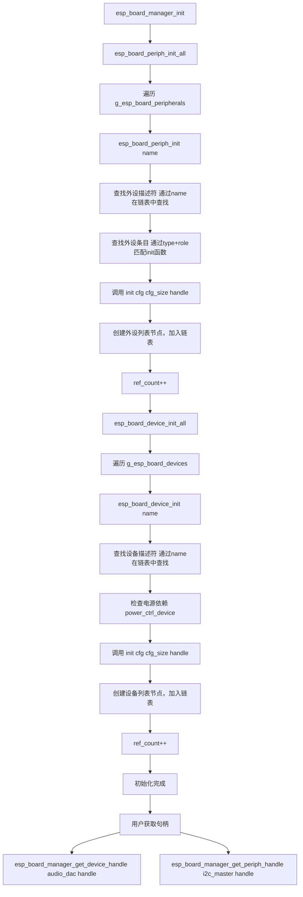

***

## 4. 设备和外设的配置初始化

### 4.1 YAML配置文件结构

#### board\_info.yaml (板级信息)

```yaml
board: esp32_p4_function_ev    # 板子标识名
chip: esp32p4                   # 芯片型号
version: 1.0.0                  # 配置版本
description: "ESP32-P4 Function-EV Board"  # 描述
manufacturer: "ESPRESSIF"        # 制造商
```

#### board\_peripherals.yaml (外设配置)

```yaml
peripherals:
  - name: i2c_master            # 外设名称 (必须以 type 开头)
    type: i2c                   # 外设类型
    role: master                # 角色
    config:                     # 外设专属配置
      port: 0                   # I2C 端口号
      pins:                     # 引脚配置
        sda: 7                  # [IO] SDA 引脚
        scl: 8                  # [IO] SCL 引脚

  - name: i2s_audio_out         # I2S 输出 (播放)
    type: i2s
    format: "std-out"          # 数据格式 (标准输出)
    role: master
    config:
      port: 0
      sample_rate_hz: 48000
      data_bit_width: 16
      slot_mode: "I2S_SLOT_MODE_STEREO"
      slot_mask: "I2S_STD_SLOT_BOTH"
      pins:
        mclk: 13
        bclk: 12
        ws: 10
        dout: 9
        din: 11

  - name: dsi_display           # DSI 显示接口
    type: dsi
    config:
      bus_id: 0
      data_lanes: 2
      lane_bit_rate_mbps: 1000
```

#### board\_devices.yaml (设备配置)

```yaml
devices:
  - name: audio_dac             # 音频 DAC 设备
    chip: es8311               # 芯片型号
    type: audio_codec          # 设备类型
    config:                     # 设备配置
      dac_enabled: true        # 启用 DAC
      dac_max_channel: 1       # DAC 通道数
      dac_channel_mask: "1"    # 通道掩码
    peripherals:               # 依赖的外设
      - name: gpio_pa_control  # 功放控制 GPIO
        gain: 6
        active_level: 1
      - name: i2s_audio_out    # I2S 输出接口
      - name: i2c_master        # I2C 控制接口
        address: 0x30          # 覆写外设配置中的地址
        frequency: 400000       # 覆写外设配置中的频率

  - name: display_lcd          # LCD 显示设备
    chip: ek79007             # LCD 驱动 IC
    type: display_lcd         # 设备类型
    sub_type: dsi             # 子类型 (DSI 接口)
    dependencies:             # 组件依赖
      espressif/esp_lcd_ek79007: "^1.0.0"
    config:
      reset_gpio_num: 27
      bits_per_pixel: 24
      dpi_config:
        dpi_clock_freq_mhz: 48
        video_timing:
          h_size: 1024
          v_size: 600
      peripherals:
        - name: ldo_mipi       # MIPI 电源
        - name: dsi_display    # DSI 总线
```

### 4.2 初始化时序图

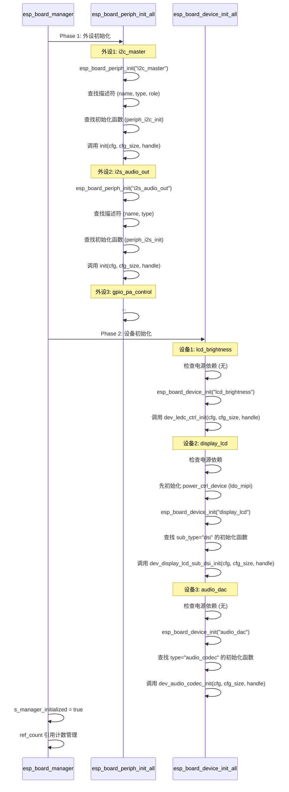

### 4.3 引用计数机制

```c
// 引用计数工作原理

// 初始化时 (ref_count = 0 -> 1)
esp_board_device_init("audio_dac")
    if (ref_count == 0) {
        // 首次初始化，调用真实的 init 函数
        init(cfg, cfg_size, &device_handle);
    }
    ref_count++;

// 再次初始化 (ref_count = 1 -> 2)
// 通常发生在多个组件需要使用同一设备时
esp_board_device_init("audio_dac")
    // 不需要再次调用 init，直接返回已有句柄
    ref_count++;

// 去初始化时
esp_board_device_deinit("audio_dac")
    ref_count--
    if (ref_count == 0) {
        // 所有使用者都已释放，真正去初始化
        deinit(device_handle);
    }
```

***

## 5. 用户使用设备的方式

### 5.1 典型使用流程

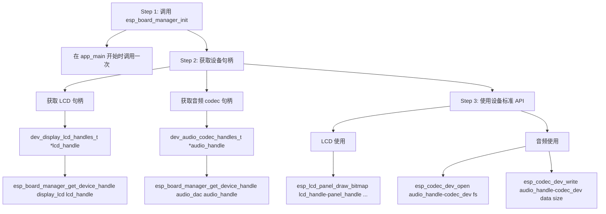

### 5.2 设备句柄结构示例

#### dev\_audio\_codec\_handles\_t (音频设备)

```c
typedef struct {
    esp_codec_dev_handle_t       codec_dev;      // Codec 设备句柄
    const audio_codec_data_if_t *data_if;        // 数据接口 (I2S)
    const audio_codec_ctrl_if_t *ctrl_if;        // 控制接口 (I2C)
    const audio_codec_gpio_if_t *gpio_if;        // GPIO 接口 (PA 控制)
    const audio_codec_if_t      *codec_if;       // Codec 接口
    int16_t                      tx_aux_out_io;  // 辅助输出 IO
} dev_audio_codec_handles_t;
```

#### dev\_display\_lcd\_handles\_t (LCD 设备)

```c
typedef struct {
    esp_lcd_panel_handle_t panel_handle;  // LCD 面板句柄
    esp_lcd_panel_io_handle_t io_handle; // LCD IO 句柄
    void *priv;                          // 私有数据
} dev_display_lcd_handles_t;
```

### 5.3 设备使用代码示例

#### LCD 显示使用

```c
// 获取 LCD 句柄
dev_display_lcd_handles_t *lcd_handle;
esp_board_manager_get_device_handle("display_lcd", (void **)&lcd_handle);

// 使用标准 esp_lcd API
uint16_t *color_data = /* 颜色数据 */;
esp_lcd_panel_draw_bitmap(lcd_handle->panel_handle,
                          0, 0,        // 起始坐标
                          1024, 600,   // 尺寸
                          color_data); // 颜色数据
```

#### 音频录制使用

```c
// 获取 ADC 句柄
dev_audio_codec_handles_t *adc_handle;
esp_board_manager_get_device_handle("audio_adc", (void **)&adc_handle);

// 配置采样参数
esp_codec_dev_sample_info_t fs = {
    .sample_rate = 16000,
    .channel = 2,
    .bits_per_sample = 16,
};

// 打开设备
esp_codec_dev_open(adc_handle->codec_dev, &fs);

// 读取音频数据
uint8_t buffer[4096];
esp_codec_dev_read(adc_handle->codec_dev, buffer, sizeof(buffer));
```

***

## 6. 同类型设备的处理机制

### 6.1 设备子类型分发

Board Manager 通过 `sub_type` 字段支持同一设备类型的不同实现：

```c
// dev_display_lcd.c 中的子类型分发逻辑
int dev_display_lcd_init(void *cfg, int cfg_size, void **device_handle)
{
    const dev_display_lcd_config_t *config = (const dev_display_lcd_config_t *)cfg;

    // 通过 sub_type 查找对应的初始化函数
    const esp_board_entry_desc_t *entry_desc = esp_board_entry_find_desc(config->sub_type);

    if (entry_desc == NULL) {
        ESP_LOGE(TAG, "Failed to find sub device: %s", config->sub_type);
        return -1;
    }

    // 调用对应子类型的初始化函数
    return entry_desc->init_func(config, cfg_size, device_handle);
}
```

### 6.2 LCD不同接口类型处理

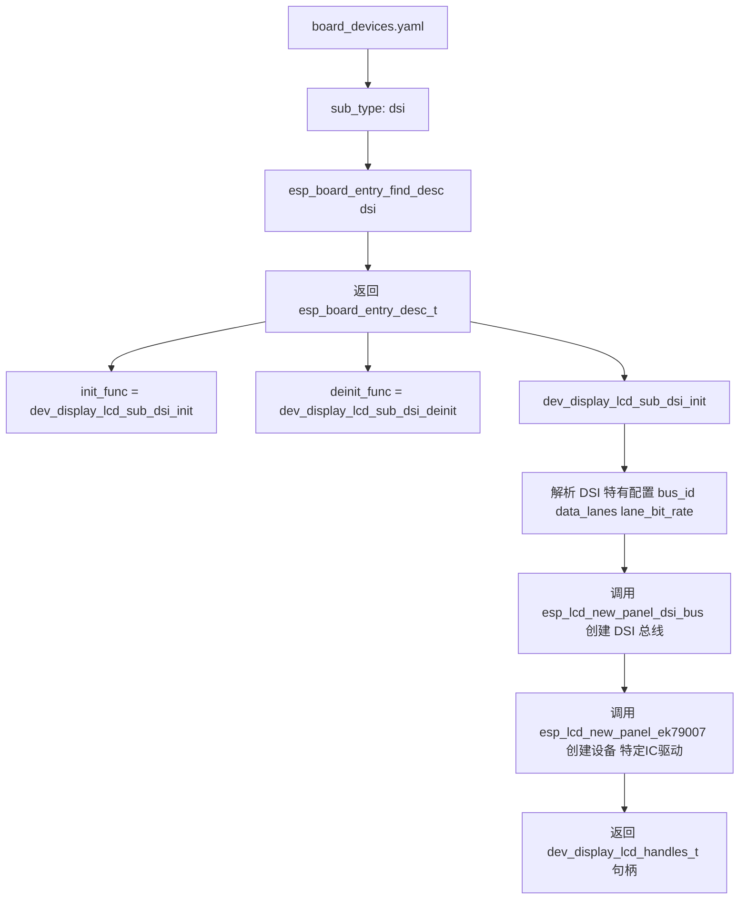

### 6.3 不同驱动IC的处理

Board Manager 支持同一接口类型但不同驱动IC的情况：

```yaml
# board_devices.yaml 中可以定义多个 LCD 设备，使用不同的 chip 字段

devices:
  # DSI 接口 + EK79007 驱动 IC
  - name: display_lcd_ek79007
    chip: ek79007
    type: display_lcd
    sub_type: dsi
    dependencies:
      espressif/esp_lcd_ek79007: "^1.0.0"
    config:
      # EK79007 特有配置

  # DSI 接口 + ST7701 驱动 IC
  - name: display_lcd_st7701
    chip: st7701
    type: display_lcd
    sub_type: dsi
    dependencies:
      espressif/esp_lcd_st7701: "^1.0.0"
    config:
      # ST7701 特有配置
```

### 6.4 外设多实例处理

```yaml
# board_peripherals.yaml

peripherals:
  # I2C 实例 0 - 用于连接 Audio Codec
  - name: i2c_master_audio
    type: i2c
    role: master
    config:
      port: 0
      pins:
        sda: 7
        scl: 8

  # I2C 实例 1 - 用于连接 Touch 芯片
  - name: i2c_master_touch
    type: i2c
    role: master
    config:
      port: 1
      pins:
        sda: 15
        scl: 16

  # I2S 实例 0 - 用于音频输出
  - name: i2s_audio_out
    type: i2s
    format: "std-out"
    role: master
    config:
      port: 0
      # ...

  # I2S 实例 1 - 用于音频输入
  - name: i2s_audio_in
    type: i2s
    format: "std-in"
    role: master
    config:
      port: 1
      # ...
```

### 6.5 设备继承与覆写机制

```yaml
# 设备可以覆写其依赖的外设配置

devices:
  - name: audio_dac
    chip: es8311
    type: audio_codec
    peripherals:
      # 覆写 i2c_master 的地址和频率
      - name: i2c_master
        address: 0x30          # 覆写外设配置
        frequency: 400000       # 覆写外设配置

      # 使用完整外设配置
      - name: i2s_audio_out
```

***

## 7. 附录：架构图汇总

### 7.1 整体架构图

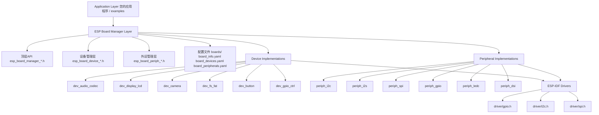

### 7.2 数据流图

```
用户应用
    │
    │ esp_board_manager_init()
    ├──────────────────────────────────────────────────────────────────▶
    │
    │
    │ esp_board_manager_get_device_handle()
    ├──────────────────────────────────────────────────────────────────▶
    │
    │
    │ esp_codec_dev_open()
    ├──────────────────────────────────────────────────────────────────▶
    │
    │
    │ (直接调用设备实现API)
    ├──────────────────────────────────────────────────────────────────▶
    │
```

