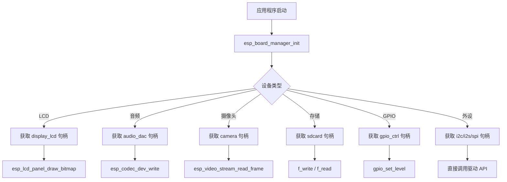

# 设备使用指南

## 概述

设备初始化完成后，用户应用程序通过以下三步使用设备：

1. **获取设备句柄** - 通过 `esp_board_manager_get_device_handle()` 获取
2. **访问底层接口** - 句柄结构包含标准 ESP-IDF 驱动接口
3. **调用标准 API** - 使用对应组件的标准 ESP-IDF API

---

## 1. LCD 显示设备使用

### 1.1 获取设备句柄

```c
#include "dev_display_lcd.h"

dev_display_lcd_handles_t *lcd_handle;
esp_board_manager_get_device_handle("display_lcd", (void **)&lcd_handle);
```

### 1.2 句柄结构

```c
typedef struct {
    esp_lcd_panel_handle_t panel_handle;  // LCD 面板句柄
    esp_lcd_panel_io_handle_t io_handle;  // LCD IO 句柄
    void *priv;                           // 私有数据
} dev_display_lcd_handles_t;
```

### 1.3 常用操作

```c
// 初始化面板
esp_lcd_panel_init(lcd_handle->panel_handle);

// 开启显示
esp_lcd_panel_disp_on_off(lcd_handle->panel_handle, true);

// 绘制位图
uint16_t *frame_buffer = /* 颜色数据 */;
esp_lcd_panel_draw_bitmap(lcd_handle->panel_handle,
                          0, 0,           // 起始坐标 (x, y)
                          1024, 600,      // 宽度、高度
                          frame_buffer);   // 像素数据

// 设置镜像
esp_lcd_panel_mirror(lcd_handle->panel_handle, true, false);

// 设置对比度
esp_lcd_panel_set_contrast(lcd_handle->panel_handle, 128);
```

### 1.4 关键 API 汇总

| API | 功能 | 头文件 |
|-----|------|--------|
| `esp_lcd_panel_init()` | 初始化面板 | `esp_lcd_panel_ops.h` |
| `esp_lcd_panel_disp_on_off()` | 开关显示 | `esp_lcd_panel_ops.h` |
| `esp_lcd_panel_draw_bitmap()` | 绘制位图 | `esp_lcd_panel_ops.h` |
| `esp_lcd_panel_mirror()` | 设置镜像 | `esp_lcd_panel_ops.h` |
| `esp_lcd_panel_set_contrast()` | 设置对比度 | `esp_lcd_panel_ops.h` |

---

## 2. 音频编解码器使用

### 2.1 获取设备句柄

```c
#include "dev_audio_codec.h"

dev_audio_codec_handles_t *audio_handle;
esp_board_manager_get_device_handle("audio_dac", (void **)&audio_handle);
```

### 2.2 句柄结构

```c
typedef struct {
    esp_codec_dev_handle_t       codec_dev;      // Codec 设备句柄
    const audio_codec_data_if_t *data_if;        // 数据接口 (I2S)
    const audio_codec_ctrl_if_t *ctrl_if;        // 控制接口 (I2C)
    const audio_codec_gpio_if_t *gpio_if;        // GPIO 接口 (PA 控制)
    const audio_codec_if_t      *codec_if;       // Codec 接口
    int16_t                      tx_aux_out_io;  // 辅助输出 IO
} dev_audio_codec_handles_t;
```

### 2.3 音频播放示例

```c
#include "esp_codec_dev.h"

// 配置采样参数
esp_codec_dev_sample_info_t fs = {
    .sample_rate = 48000,
    .channel = 2,
    .bits_per_sample = 16,
};

// 打开设备
esp_codec_dev_open(audio_handle->codec_dev, &fs);

// 写入音频数据
uint8_t audio_buffer[4096];
size_t bytes_written;
esp_codec_dev_write(audio_handle->codec_dev, audio_buffer, sizeof(audio_buffer), &bytes_written);

// 关闭设备
esp_codec_dev_close(audio_handle->codec_dev);
```

### 2.4 音频录制示例

```c
// 获取 ADC 设备句柄
dev_audio_codec_handles_t *adc_handle;
esp_board_manager_get_device_handle("audio_adc", (void **)&adc_handle);

// 配置采样参数
esp_codec_dev_sample_info_t fs = {
    .sample_rate = 16000,
    .channel = 2,
    .bits_per_sample = 16,
};

// 打开设备
esp_codec_dev_open(adc_handle->codec_dev, &fs);

// 读取音频数据
uint8_t buffer[4096];
size_t bytes_read;
esp_codec_dev_read(adc_handle->codec_dev, buffer, sizeof(buffer), &bytes_read);

// 关闭设备
esp_codec_dev_close(adc_handle->codec_dev);
```

### 2.5 关键 API 汇总

| API | 功能 | 头文件 |
|-----|------|--------|
| `esp_codec_dev_open()` | 打开音频设备 | `esp_codec_dev.h` |
| `esp_codec_dev_write()` | 写入音频数据 | `esp_codec_dev.h` |
| `esp_codec_dev_read()` | 读取音频数据 | `esp_codec_dev.h` |
| `esp_codec_dev_close()` | 关闭音频设备 | `esp_codec_dev.h` |
| `esp_codec_dev_set_vol()` | 设置音量 | `esp_codec_dev.h` |

---

## 3. 摄像头设备使用

### 3.1 获取设备句柄

```c
#include "dev_camera.h"

dev_camera_handle_t *camera_handle;
esp_board_manager_get_device_handle(ESP_BOARD_DEVICE_NAME_CAMERA, (void **)&camera_handle);
```

### 3.2 句柄结构

```c
typedef struct {
    const char *dev_path;     // 摄像头设备路径，如 /dev/video0
    const char *meta_path;    // 元数据路径（CSI摄像头），如 /dev/video11
} dev_camera_handle_t;
```

### 3.3 摄像头使用示例（V4L2 标准接口）

摄像头使用标准 Linux V4L2（Video for Linux 2）接口进行操作：

```c
#include <fcntl.h>
#include <unistd.h>
#include <sys/ioctl.h>
#include <sys/mman.h>
#include <linux/videodev2.h>

#define BUFFER_COUNT 2

static esp_err_t camera_capture_stream(const char *cam_dev_path)
{
    int fd;
    uint8_t *buffer[BUFFER_COUNT];
    struct v4l2_buffer buf;
    struct v4l2_requestbuffers req;
    struct v4l2_format format;
    const int type = V4L2_BUF_TYPE_VIDEO_CAPTURE;

    // 1. 打开设备
    fd = open(cam_dev_path, O_RDONLY);
    if (fd < 0) {
        ESP_LOGE(TAG, "failed to open device");
        return ESP_FAIL;
    }

    // 2. 查询设备能力
    struct v4l2_capability capability;
    if (ioctl(fd, VIDIOC_QUERYCAP, &capability) != 0) {
        ESP_LOGE(TAG, "failed to get capability");
        close(fd);
        return ESP_FAIL;
    }

    // 3. 设置视频格式
    memset(&format, 0, sizeof(format));
    format.type = type;
    format.fmt.pix.width = 640;
    format.fmt.pix.height = 480;
    format.fmt.pix.pixelformat = V4L2_PIX_FMT_RGB565;
    if (ioctl(fd, VIDIOC_S_FMT, &format) != 0) {
        ESP_LOGE(TAG, "failed to set format");
        close(fd);
        return ESP_FAIL;
    }

    // 4. 请求缓冲区
    memset(&req, 0, sizeof(req));
    req.count = BUFFER_COUNT;
    req.type = type;
    req.memory = V4L2_MEMORY_MMAP;
    if (ioctl(fd, VIDIOC_REQBUFS, &req) != 0) {
        ESP_LOGE(TAG, "failed to require buffer");
        close(fd);
        return ESP_FAIL;
    }

    // 5. 映射缓冲区
    for (int i = 0; i < BUFFER_COUNT; i++) {
        memset(&buf, 0, sizeof(buf));
        buf.type = type;
        buf.memory = V4L2_MEMORY_MMAP;
        buf.index = i;
        if (ioctl(fd, VIDIOC_QUERYBUF, &buf) != 0) {
            ESP_LOGE(TAG, "failed to query buffer");
            close(fd);
            return ESP_FAIL;
        }

        buffer[i] = (uint8_t *)mmap(NULL, buf.length, PROT_READ | PROT_WRITE,
                                    MAP_SHARED, fd, buf.m.offset);
        if (!buffer[i]) {
            ESP_LOGE(TAG, "failed to map buffer");
            close(fd);
            return ESP_FAIL;
        }

        // 6. 入队缓冲区
        if (ioctl(fd, VIDIOC_QBUF, &buf) != 0) {
            ESP_LOGE(TAG, "failed to queue buffer");
            close(fd);
            return ESP_FAIL;
        }
    }

    // 7. 启动流
    if (ioctl(fd, VIDIOC_STREAMON, &type) != 0) {
        ESP_LOGE(TAG, "failed to start stream");
        close(fd);
        return ESP_FAIL;
    }

    // 8. 循环读取帧
    int frame_count = 0;
    while (frame_count < 10) {
        memset(&buf, 0, sizeof(buf));
        buf.type = type;
        buf.memory = V4L2_MEMORY_MMAP;
        
        // 出队缓冲区（等待帧数据）
        if (ioctl(fd, VIDIOC_DQBUF, &buf) != 0) {
            ESP_LOGE(TAG, "failed to dequeue buffer");
            break;
        }

        // 检查帧是否有效
        if (buf.flags & V4L2_BUF_FLAG_DONE) {
            // 处理图像数据，buffer[buf.index] 包含帧数据
            ESP_LOGI(TAG, "Frame captured: %d bytes", buf.bytesused);
            frame_count++;
        }

        // 重新入队缓冲区
        if (ioctl(fd, VIDIOC_QBUF, &buf) != 0) {
            ESP_LOGE(TAG, "failed to queue buffer");
            break;
        }
    }

    // 9. 停止流
    if (ioctl(fd, VIDIOC_STREAMOFF, &type) != 0) {
        ESP_LOGE(TAG, "failed to stop stream");
    }

    // 10. 释放缓冲区
    for (int i = 0; i < BUFFER_COUNT; i++) {
        if (buffer[i]) {
            munmap(buffer[i], buf.length);
        }
    }

    close(fd);
    return ESP_OK;
}
```

### 3.4 枚举支持的格式

```c
void camera_enum_formats(int fd)
{
    struct v4l2_fmtdesc fmtdesc;
    const int type = V4L2_BUF_TYPE_VIDEO_CAPTURE;

    for (int i = 0;; i++) {
        memset(&fmtdesc, 0, sizeof(fmtdesc));
        fmtdesc.index = i;
        fmtdesc.type = type;

        if (ioctl(fd, VIDIOC_ENUM_FMT, &fmtdesc) != 0) {
            break;
        }

        ESP_LOGI(TAG, "Format %d: %s (0x%08X)", i, 
                 (char *)fmtdesc.description, fmtdesc.pixelformat);
    }
}
```

### 3.5 获取 ISP 元数据（CSI摄像头）

CSI 摄像头支持获取 ISP（图像信号处理器）元数据：

```c
if (camera_handle->meta_path) {
    int meta_fd = open(camera_handle->meta_path, O_RDONLY);
    if (meta_fd >= 0) {
        struct v4l2_format format;
        format.type = V4L2_BUF_TYPE_META_CAPTURE;
        
        if (ioctl(meta_fd, VIDIOC_G_FMT, &format) == 0) {
            ESP_LOGI(TAG, "Meta format: %dx%d", 
                     format.fmt.meta.width, format.fmt.meta.height);
        }
        close(meta_fd);
    }
}
```

### 3.6 完整使用示例

```c
#include "esp_board_manager.h"
#include "dev_camera.h"

void camera_example(void)
{
    // 1. 获取摄像头句柄
    dev_camera_handle_t *camera_handle = NULL;
    esp_err_t ret = esp_board_manager_get_device_handle(
        ESP_BOARD_DEVICE_NAME_CAMERA, (void **)&camera_handle);
    if (ret != ESP_OK) {
        ESP_LOGE(TAG, "Failed to get camera device");
        return;
    }

    ESP_LOGI(TAG, "Camera device path: %s", camera_handle->dev_path);
    if (camera_handle->meta_path) {
        ESP_LOGI(TAG, "Camera meta path: %s", camera_handle->meta_path);
    }

    // 2. 捕获视频流
    ret = camera_capture_stream(camera_handle->dev_path);
    if (ret != ESP_OK) {
        ESP_LOGE(TAG, "Failed to capture stream");
    }
}
```

### 3.7 关键 V4L2 IOCTL 汇总

| IOCTL | 功能 | 说明 |
|-------|------|------|
| `VIDIOC_QUERYCAP` | 查询设备能力 | 获取设备支持的功能 |
| `VIDIOC_ENUM_FMT` | 枚举支持格式 | 列出所有支持的像素格式 |
| `VIDIOC_S_FMT` | 设置视频格式 | 配置分辨率、像素格式 |
| `VIDIOC_G_FMT` | 获取当前格式 | 读取当前配置 |
| `VIDIOC_REQBUFS` | 请求缓冲区 | 分配帧缓冲区 |
| `VIDIOC_QUERYBUF` | 查询缓冲区 | 获取缓冲区信息 |
| `VIDIOC_QBUF` | 入队缓冲区 | 将缓冲区加入队列 |
| `VIDIOC_DQBUF` | 出队缓冲区 | 获取已填充的帧 |
| `VIDIOC_STREAMON` | 启动流 | 开始采集 |
| `VIDIOC_STREAMOFF` | 停止流 | 停止采集 |

### 3.8 支持的像素格式

| 格式 | V4L2 常量 | 说明 |
|------|-----------|------|
| RGB565 | `V4L2_PIX_FMT_RGB565` | 16位 RGB |
| YUV422P | `V4L2_PIX_FMT_YUV422P` | YUV 4:2:2 平面格式 |
| SBGGR8 | `V4L2_PIX_FMT_SBGGR8` | 8位拜耳格式 |
| GREY | `V4L2_PIX_FMT_GREY` | 8位灰度 |

---

## 4. 存储设备使用

### 4.1 获取设备句柄

```c
#include "dev_fs_fat.h"

dev_fs_fat_handle_t *fs_handle;
esp_board_manager_get_device_handle("sdcard", (void **)&fs_handle);
```

### 4.2 文件操作示例

```c
#include "ff.h"

FATFS fs;
FIL file;
FRESULT res;

// 挂载文件系统
res = f_mount(&fs, fs_handle->base_path, 1);
if (res != FR_OK) {
    ESP_LOGE(TAG, "Failed to mount filesystem");
    return;
}

// 打开文件
res = f_open(&file, "/sdcard/test.txt", FA_WRITE | FA_CREATE_ALWAYS);
if (res != FR_OK) {
    ESP_LOGE(TAG, "Failed to open file");
    return;
}

// 写入数据
const char *data = "Hello, ESP32!";
UINT bytes_written;
res = f_write(&file, data, strlen(data), &bytes_written);

// 关闭文件
f_close(&file);

// 卸载文件系统
f_mount(NULL, fs_handle->base_path, 0);
```

### 4.3 关键 API 汇总

| API | 功能 | 头文件 |
|-----|------|--------|
| `f_mount()` | 挂载文件系统 | `ff.h` |
| `f_open()` | 打开文件 | `ff.h` |
| `f_write()` | 写入文件 | `ff.h` |
| `f_read()` | 读取文件 | `ff.h` |
| `f_close()` | 关闭文件 | `ff.h` |

---

## 5. GPIO 控制设备使用

### 5.1 获取设备句柄

```c
#include "dev_gpio_ctrl.h"

dev_gpio_ctrl_handles_t *gpio_handle;
esp_board_manager_get_device_handle("gpio_led", (void **)&gpio_handle);
```

### 5.2 GPIO 操作示例

```c
// 设置 GPIO 输出电平
gpio_set_level(gpio_handle->gpio_num, 1);  // 高电平

// 读取 GPIO 输入电平
int level = gpio_get_level(gpio_handle->gpio_num);

// 设置 GPIO 方向
gpio_set_direction(gpio_handle->gpio_num, GPIO_MODE_OUTPUT);
```

---

## 6. 外设直接使用

### 6.1 I2C 外设

```c
#include "driver/i2c.h"

// 获取 I2C 外设句柄
i2c_master_bus_handle_t i2c_handle;
esp_board_manager_get_periph_handle("i2c_master", (void **)&i2c_handle);

// I2C 写操作
uint8_t data[2] = {0x00, 0x10};
i2c_master_transmit(i2c_handle, 0x30, data, sizeof(data), pdMS_TO_TICKS(100));

// I2C 读操作
uint8_t recv_data[4];
i2c_master_receive(i2c_handle, 0x30, recv_data, sizeof(recv_data), pdMS_TO_TICKS(100));
```

### 6.2 I2S 外设

```c
#include "driver/i2s_std.h"

// 获取 I2S 外设句柄
i2s_chan_handle_t i2s_handle;
esp_board_manager_get_periph_handle("i2s_audio_out", (void **)&i2s_handle);

// I2S 写入数据
uint8_t i2s_buffer[512];
size_t bytes_written;
i2s_channel_write(i2s_handle, i2s_buffer, sizeof(i2s_buffer), &bytes_written, portMAX_DELAY);
```

### 6.3 SPI 外设

```c
#include "driver/spi_master.h"

// 获取 SPI 外设句柄
spi_device_handle_t spi_handle;
esp_board_manager_get_periph_handle("spi_master", (void **)&spi_handle);

// SPI 传输
spi_transaction_t t = {
    .length = 8 * 4,  // 4 bytes
    .tx_buffer = tx_data,
    .rx_buffer = rx_data,
};
spi_device_transmit(spi_handle, &t);
```

---

## 7. 完整使用流程图



---

## 8. 设备生命周期管理

### 8.1 引用计数机制

Board Manager 使用引用计数管理设备生命周期：

```c
// 首次初始化 (ref_count = 0 -> 1)
esp_board_manager_init_device_by_name("display_lcd");

// 再次获取 (ref_count = 1 -> 2)
// 不重复初始化，返回已有句柄
esp_board_manager_get_device_handle("display_lcd", &handle);

// 去初始化 (ref_count = 2 -> 1)
esp_board_manager_deinit_device_by_name("display_lcd");

// 最终去初始化 (ref_count = 1 -> 0)
// 真正释放资源
esp_board_manager_deinit_device_by_name("display_lcd");
```

### 8.2 最佳实践

1. **单次初始化**：在 `app_main()` 开始时调用 `esp_board_manager_init()`
2. **按需获取**：在需要使用设备时获取句柄
3. **及时释放**：不再使用设备时调用去初始化
4. **错误处理**：检查所有 API 返回值

---

## 附录：设备类型与 API 映射表

| 设备类型 | 句柄结构 | 核心 API | 头文件 |
|---------|---------|---------|--------|
| display_lcd | `dev_display_lcd_handles_t` | `esp_lcd_panel_*` | `dev_display_lcd.h` |
| audio_dac | `dev_audio_codec_handles_t` | `esp_codec_dev_*` | `dev_audio_codec.h` |
| camera | `dev_camera_handle_t` | `esp_video_*` | `dev_camera.h` |
| fs_fat | `dev_fs_fat_handle_t` | `f_*` | `dev_fs_fat.h` |
| gpio_ctrl | `dev_gpio_ctrl_handles_t` | `gpio_*` | `dev_gpio_ctrl.h` |
| i2c_master | `i2c_master_bus_handle_t` | `i2c_master_*` | `driver/i2c.h` |
| i2s_audio | `i2s_chan_handle_t` | `i2s_channel_*` | `driver/i2s_std.h` |
| spi_master | `spi_device_handle_t` | `spi_device_*` | `driver/spi_master.h` |
