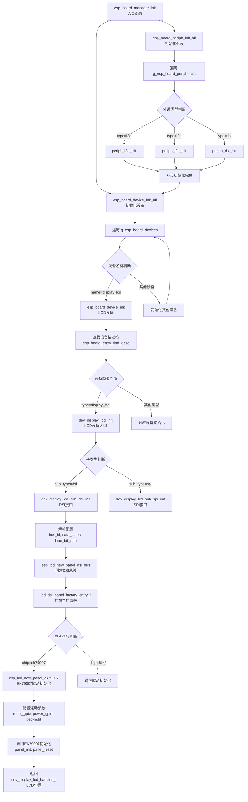
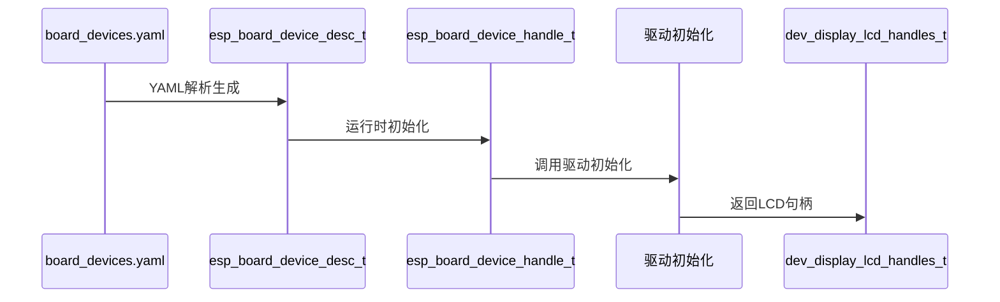
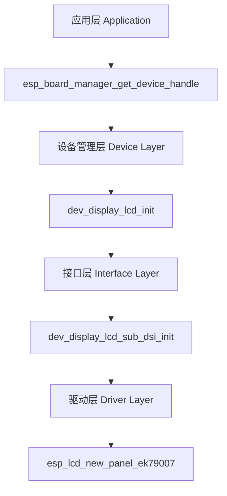
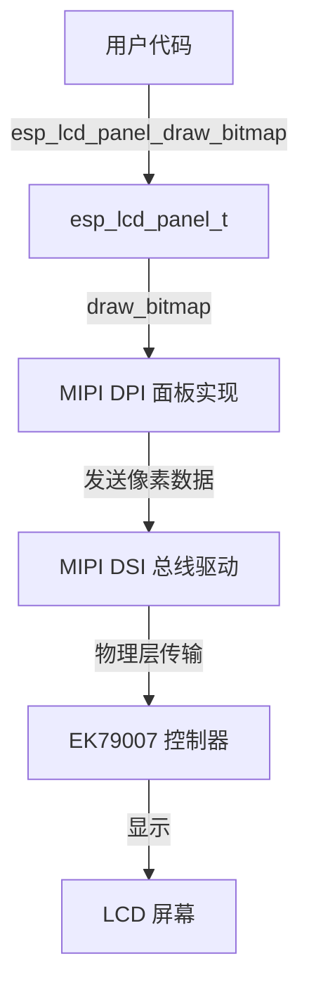

# LCD 初始化流程与 EK79007 驱动使用指南

---

## 目录

1. [概述](#1-概述)
2. [整体调用流程](#2-整体调用流程)
3. [初始化阶段详解](#3-初始化阶段详解)
4. [数据结构流转](#4-数据结构流转)
5. [关键 API 汇总](#5-关键-api-汇总)
6. [配置示例](#6-配置示例)
7. [设计模式分析](#7-设计模式分析)
8. [故障排除](#8-故障排除)

---

## 1. 概述

本文档详细介绍从 `esp_board_manager_init()` 到 EK79007 LCD 驱动初始化的完整流程，包括：
- 各阶段的核心函数和数据结构
- 配置文件如何驱动初始化流程
- ESP-LCD 组件的层次调用关系
- EK79007 驱动的 Hook 机制

---

## 2. 整体调用流程



---

## 3. 初始化阶段详解

### 阶段 1: `esp_board_manager_init()`

**文件**: `src/esp_board_manager.c`

```c
esp_err_t esp_board_manager_init(void)
{
    // 先初始化所有外设（DSI、LDO、I2C等）
    esp_err_t ret = esp_board_periph_init_all();
    if (ret != ESP_OK) return ret;
    
    // 再初始化所有设备（LCD、Audio等）
    ret = esp_board_device_init_all();
    if (ret != ESP_OK) {
        esp_board_periph_deinit_all();
        return ret;
    }
    
    s_manager_initialized = true;
    return ESP_OK;
}
```

**设计要点**:
- **顺序保证**: 外设先于设备初始化
- **失败回滚**: 设备初始化失败时会回滚外设

### 阶段 2: `esp_board_periph_init_all()`

初始化 LCD 所需的关键外设：

| 外设名称 | 类型 | 作用 |
|---------|------|------|
| `dsi_display` | DSI总线 | 提供 MIPI-DSI 高速数据传输 |
| `ldo_mipi` | LDO电源 | 为 LCD 面板提供稳定电源 |

### 阶段 3: `esp_board_device_init()`

**文件**: `src/esp_board_device.c`

```c
esp_err_t esp_board_device_init(const char *name)
{
    // 查找设备描述符
    const esp_board_device_desc_t *desc = esp_board_find_device_desc(name);
    
    // 电源控制（如果配置了 power_ctrl_device）
    if (desc->power_ctrl_device) {
        esp_board_device_power_ctrl(name, true);
    }
    
    // 查找或创建设备句柄
    esp_board_device_handle_t *handle = esp_board_find_device_handle(name);
    
    // 引用计数管理
    handle->ref_count++;
    
    // 调用设备特定的 init 函数
    if (!handle->device_handle) {
        const void *cfg = find_effective_cfg(name, desc, &cfg_size);
        ret = handle->init((void *)cfg, cfg_size, &handle->device_handle);
    }
    return ESP_OK;
}
```

**关键数据结构**:

| 数据结构 | 作用 | 关键字段 |
|---------|------|---------|
| `esp_board_device_desc_t` | 编译期设备描述符 | `name`, `chip`, `type`, `sub_type`, `cfg` |
| `esp_board_device_handle_t` | 运行时设备句柄 | `device_handle`, `ref_count`, `init`, `deinit` |

### 阶段 4: `dev_display_lcd_init()`

**文件**: `devices/dev_display_lcd/dev_display_lcd.c`

```c
int dev_display_lcd_init(void *cfg, int cfg_size, void **device_handle)
{
    const dev_display_lcd_config_t *config = (const dev_display_lcd_config_t *)cfg;
    
    // 根据 sub_type 选择子设备入口
    const esp_board_entry_desc_t *entry_desc = esp_board_entry_find_desc(config->sub_type);
    // 例如: sub_type = "dsi"
    
    // 调用子设备初始化
    ret = entry_desc->init_func((void *)config, cfg_size, (void **)&handle);
    
    // LCD 面板重置与初始化
    if (config->need_reset) {
        esp_lcd_panel_reset(handle->panel_handle);
    }
    esp_lcd_panel_init(handle->panel_handle);
    
    // 镜像、交换、颜色反转等设置
    esp_lcd_panel_mirror(handle->panel_handle, config->mirror_x, config->mirror_y);
    esp_lcd_panel_swap_xy(handle->panel_handle, config->swap_xy);
    
    // 开启显示
    esp_lcd_panel_disp_on_off(handle->panel_handle, true);
    
    *device_handle = handle;
    return 0;
}
```

### 阶段 5: `dev_display_lcd_sub_dsi_init()`

**文件**: `devices/dev_display_lcd/dev_display_lcd_sub_dsi.c`

```c
int dev_display_lcd_sub_dsi_init(void *cfg, int cfg_size, void **device_handle)
{
    dev_display_lcd_config_t *lcd_cfg = (dev_display_lcd_config_t *)cfg;
    dev_display_lcd_handles_t *lcd_handles = calloc(1, sizeof(dev_display_lcd_handles_t));
    
    // 获取 LDO 外设句柄（电源控制）
    esp_ldo_channel_handle_t ldo_handle = NULL;
    esp_board_periph_ref_handle(lcd_cfg->sub_cfg.dsi.ldo_name, (void **)&ldo_handle);
    
    // 获取 DSI 外设句柄
    esp_lcd_dsi_bus_handle_t dsi_handle = NULL;
    esp_board_periph_ref_handle(lcd_cfg->sub_cfg.dsi.dsi_name, (void **)&dsi_handle);
    
    // 创建 DBI IO（Display Bus Interface）
    esp_lcd_new_panel_io_dbi(dsi_handle, &lcd_cfg->sub_cfg.dsi.dbi_config, &lcd_handles->io_handle);
    
    // 调用工厂函数创建面板
    lcd_dsi_panel_factory_entry_t(dsi_handle, lcd_cfg, lcd_handles);
    
    *device_handle = lcd_handles;
    return 0;
}
```

### 阶段 6: `lcd_dsi_panel_factory_entry_t()`

**文件**: `components/board_esp32_p4_wifi6/setup_device.c`

这是**厂商实现的关键入口**，负责调用具体驱动 IC：

```c
esp_err_t lcd_dsi_panel_factory_entry_t(esp_lcd_dsi_bus_handle_t dsi_handle, 
                                        dev_display_lcd_config_t *lcd_cfg, 
                                        dev_display_lcd_handles_t *lcd_handles)
{
    // 配置 EK79007 专属参数
    ek79007_vendor_config_t vendor_config = {
        .mipi_config = {
            .dsi_bus = dsi_handle,
            .dpi_config = &lcd_cfg->sub_cfg.dsi.dpi_config,
        },
    };
    
    // 配置通用面板参数
    esp_lcd_panel_dev_config_t lcd_dev_config = {
        .reset_gpio_num = lcd_cfg->sub_cfg.dsi.reset_gpio_num,
        .rgb_ele_order = lcd_cfg->rgb_ele_order,
        .bits_per_pixel = lcd_cfg->bits_per_pixel,
        .vendor_config = &vendor_config,  // 传递 EK79007 专属配置
    };
    
    // 调用 EK79007 驱动初始化
    esp_err_t ret = esp_lcd_new_panel_ek79007(lcd_handles->io_handle, 
                                             &lcd_dev_config, 
                                             &lcd_handles->panel_handle);
    return ret;
}
```

### 阶段 7: `esp_lcd_new_panel_ek79007()`

**文件**: `managed_components/espressif__esp_lcd_ek79007/esp_lcd_ek79007.c`

这是 ESP-LCD 组件提供的驱动初始化函数，使用 **Hook 机制**：

```c
esp_err_t esp_lcd_new_panel_ek79007(esp_lcd_panel_io_handle_t io, 
                                    const esp_lcd_panel_dev_config_t *panel_dev_config,
                                    esp_lcd_panel_handle_t *ret_panel)
{
    // 1. 创建基础 DPI 面板
    esp_lcd_new_panel_dpi(io, panel_dev_config, ret_panel);
    
    // 2. 保存原始函数指针
    ek79007->del = (*ret_panel)->del;
    ek79007->init = (*ret_panel)->init;
    
    // 3. 重写钩子函数（Wrapper）
    (*ret_panel)->del = panel_ek79007_del;
    (*ret_panel)->init = panel_ek79007_init;  // 关键：覆盖初始化函数
    (*ret_panel)->user_data = ek79007;
    
    return ESP_OK;
}

// EK79007 专属初始化函数
static esp_err_t panel_ek79007_init(esp_lcd_panel_handle_t panel)
{
    // 发送 EK79007 芯片初始化命令序列
    // - 设置显示分辨率
    // - 配置时序参数
    // - 设置颜色格式
    // - 其他芯片专属配置
    
    // 调用原始 DPI 初始化
    ek79007->init(panel);
    
    return ESP_OK;
}
```

**Hook 机制原理**:
- 先创建基础 DPI 面板
- 保存原始函数指针
- 覆盖为 EK79007 专属函数
- 专属函数内部调用原始函数 + 芯片特定初始化

---

## 4. 数据结构流转



**数据结构流转说明：**

| 阶段 | 数据结构 | 说明 |
|-----|---------|------|
| 1 | `board_devices.yaml` | 配置文件，定义设备参数 |
| 2 | `esp_board_device_desc_t` | 编译期设备描述符（生成器产生） |
| 3 | `esp_board_device_handle_t` | 运行时设备句柄 |
| 4 | `驱动初始化` | 调用具体驱动（如 EK79007） |
| 5 | `dev_display_lcd_handles_t` | LCD专用句柄（包含io_handle和panel_handle） |


---

## 5. 关键 API 汇总

| API 函数 | 所属文件 | 功能描述 |
|---------|---------|---------|
| `esp_board_manager_init()` | `esp_board_manager.c` | 初始化整个板级管理器 |
| `esp_board_periph_init_all()` | `esp_board_periph.c` | 初始化所有外设 |
| `esp_board_device_init_all()` | `esp_board_device.c` | 初始化所有设备 |
| `esp_board_device_init()` | `esp_board_device.c` | 初始化单个设备，处理引用计数 |
| `dev_display_lcd_init()` | `dev_display_lcd.c` | LCD 设备初始化入口 |
| `dev_display_lcd_sub_dsi_init()` | `dev_display_lcd_sub_dsi.c` | DSI 接口子设备初始化 |
| `lcd_dsi_panel_factory_entry_t()` | `setup_device.c` | 面板工厂函数（厂商实现） |
| `esp_lcd_new_panel_ek79007()` | `esp_lcd_ek79007.c` | EK79007 驱动初始化 |
| `esp_lcd_panel_init()` | `esp_lcd_panel_ops.c` | 通用面板初始化 |
| `esp_lcd_panel_draw_bitmap()` | `esp_lcd_panel_ops.c` | 绘制位图 |

---

## 6. 配置示例

### 6.1 YAML 配置示例

```yaml
# board_devices.yaml
devices:
  - name: display_lcd
    chip: ek79007
    type: display_lcd
    sub_type: dsi
    config:
      lcd_width: 1024
      lcd_height: 600
      swap_xy: false
      mirror_x: false
      mirror_y: false
      need_reset: true
      invert_color: false
      bits_per_pixel: 24
      sub_cfg:
        dsi:
          dsi_name: dsi_display
          ldo_name: ldo_mipi
          reset_gpio_num: 27
          reset_active_high: false
          dpi_config:
            dpi_clock_freq_mhz: 48
            video_timing:
              h_size: 1024
              v_size: 600
```

### 6.2 用户代码使用示例

```c
#include "esp_board_manager.h"
#include "dev_display_lcd.h"

void app_main(void)
{
    // 1. 初始化板级管理器
    esp_board_manager_init();
    
    // 2. 获取 LCD 设备句柄
    dev_display_lcd_handles_t *lcd_handle;
    esp_board_manager_get_device_handle("display_lcd", (void **)&lcd_handle);
    
    // 3. 使用标准 ESP-LCD API
    // 绘制颜色数据
    uint16_t *frame_buffer = /* 颜色数据 */;
    esp_lcd_panel_draw_bitmap(lcd_handle->panel_handle,
                              0, 0,           // 起始坐标
                              1024, 600,      // 尺寸
                              frame_buffer);  // 颜色数据
    
    // 关闭显示
    esp_lcd_panel_disp_on_off(lcd_handle->panel_handle, false);
}
```

---

## 7. 设计模式分析

### 7.1 分层解耦



### 7.2 设计模式总结

| 设计模式 | 应用位置 | 作用 |
|---------|---------|------|
| **工厂模式** | `lcd_dsi_panel_factory_entry_t()` | 厂商实现具体驱动选择 |
| **策略模式** | `sub_type` 分发 | 动态选择初始化函数 |
| **装饰器模式** | Hook 机制 | 包装基础面板函数 |
| **单例模式** | `s_manager_initialized` | 防止重复初始化 |
| **引用计数** | `ref_count` | 共享设备管理 |

### 7.3 Hook 机制详解

EK79007 驱动使用了 **Hook 模式** 来增强底层 MIPI DPI 面板的功能：

```c
// 先创建底层 MIPI DPI 面板
esp_lcd_new_panel_dpi(dsi_bus, dpi_config, ret_panel);

// 保存原始函数指针
ek79007->del = (*ret_panel)->del;
ek79007->init = (*ret_panel)->init;

// 覆盖特定函数
(*ret_panel)->del = panel_ek79007_del;
(*ret_panel)->init = panel_ek79007_init;
(*ret_panel)->reset = panel_ek79007_reset;
(*ret_panel)->mirror = panel_ek79007_mirror;
(*ret_panel)->invert_color = panel_ek79007_invert_color;
```

#### 函数覆盖策略

| 函数 | 是否覆盖 | 原因 |
|-----|---------|------|
| `init` | 是 | 需要添加 EK79007 特定的初始化命令 |
| `reset` | 是 | 需要控制 EK79007 的复位引脚 |
| `mirror` | 是 | 需要发送 EK79007 特定的镜像控制命令 |
| `invert_color` | 是 | 需要发送 EK79007 特定的颜色反转命令 |
| `draw_bitmap` | **否** | **由底层 MIPI DPI 面板实现，无需修改** |

#### 为什么 `draw_bitmap` 不需要覆盖？

`draw_bitmap` 是由 **MIPI DSI 总线驱动** 实现的，它负责将像素数据通过 DSI 总线发送到屏幕。EK79007 只是屏幕控制器，不负责数据传输。

#### 用户如何调用 `draw_bitmap`

用户通过标准的 ESP-LCD 接口调用：

```c
// 获取 LCD 句柄
dev_display_lcd_handles_t *lcd_handle;
esp_board_manager_get_device_handle("display_lcd", &lcd_handle);

// 直接调用标准 API
esp_lcd_panel_draw_bitmap(lcd_handle->panel_handle, 
                          x_start, y_start, 
                          x_end, y_end, 
                          pixel_data);
```

#### 调用链分析



EK79007 驱动的角色是：
1. **初始化阶段**：发送 EK79007 特定的配置命令
2. **运行阶段**：处理镜像、颜色反转等控制命令
3. **数据传输**：**不参与**，由 MIPI DSI 总线驱动负责

---

## 8. LCD驱动IC查找与调用

### 8.1 驱动组件位置

**EK79007 驱动组件**：

```
managed_components/espressif__esp_lcd_ek79007/
├── esp_lcd_ek79007.c          # 驱动实现
├── include/esp_lcd_ek79007.h   # 驱动头文件
└── test_apps/                  # 测试程序
```

**核心API**：

```c
esp_err_t esp_lcd_new_panel_ek79007(
    const esp_lcd_panel_io_handle_t io,
    const esp_lcd_panel_dev_config_t *panel_dev_config,
    esp_lcd_panel_handle_t *ret_panel
);
```

### 8.2 驱动调用流程

```
用户应用
    │
    ▼
esp_board_manager_init()
    │
    └─> dev_display_lcd_init()
            │
            │ 根据 sub_type 分发
            ▼
        dev_display_lcd_sub_dsi_init()  [DSI接口]
            │
            │ 调用工厂函数
            ▼
        lcd_dsi_panel_factory_entry_t()
            │
            │ 根据 chip 字段选择驱动
            ▼
        esp_lcd_new_panel_ek79007()  ← 最终调用驱动
```

### 8.3 配置文件中的驱动选择

在 `board_devices.yaml` 中配置：

```yaml
devices:
  - name: display_lcd
    chip: ek79007           # ← 选择驱动IC
    type: display_lcd
    sub_type: dsi           # ← 选择接口类型
    config:
      reset_gpio_num: 27
      bits_per_pixel: 24
      sub_cfg:
        dsi:
          ldo_name: ldo_mipi
          dsi_name: dsi_display
          dpi_config:
            dpi_clock_freq_mhz: 48
            video_timing:
              h_size: 1024
              v_size: 600
```

### 8.4 工厂函数实现

```c
esp_err_t lcd_dsi_panel_factory_entry_t(
    esp_lcd_dsi_bus_handle_t dsi_handle,
    dev_display_lcd_config_t *lcd_cfg,
    dev_display_lcd_handles_t *lcd_handles
)
{
    // 根据 chip 字段选择不同驱动
    if (strcmp(lcd_cfg->chip, "ek79007") == 0) {
        // EK79007 驱动配置
        ek79007_vendor_config_t vendor_config = {
            .mipi_config = {
                .dsi_bus = dsi_handle,
                .dpi_config = &lcd_cfg->sub_cfg.dsi.dpi_config,
            },
        };

        esp_lcd_panel_dev_config_t lcd_dev_config = {
            .reset_gpio_num = lcd_cfg->sub_cfg.dsi.reset_gpio_num,
            .bits_per_pixel = lcd_cfg->bits_per_pixel,
            .vendor_config = &vendor_config,
        };

        return esp_lcd_new_panel_ek79007(
            lcd_handles->io_handle,
            &lcd_dev_config,
            &lcd_handles->panel_handle
        );
    }
    else if (strcmp(lcd_cfg->chip, "st7701") == 0) {
        // ST7701 驱动配置 (需要添加 st7701 驱动组件)
        // st7701_vendor_config_t vendor_config = {...};
        // return esp_lcd_new_panel_st7701(...);
    }

    return ESP_ERR_NOT_SUPPORTED;
}
```

### 8.5 添加新驱动IC的步骤

**步骤 1**：添加驱动组件依赖到 `idf_component.yml`

```yaml
dependencies:
  espressif/esp_lcd_ek79007: "^1.0.0"
  # espressif/esp_lcd_st7701: "^1.0.0"  # 如果需要 ST7701
```

**步骤 2**：在 `setup_device.c` 中添加工厂函数分支

```c
#include "esp_lcd_st7701.h"  // 添加新驱动头文件

esp_err_t lcd_dsi_panel_factory_entry_t(...)
{
    if (strcmp(lcd_cfg->chip, "ek79007") == 0) {
        // EK79007 处理
    }
    else if (strcmp(lcd_cfg->chip, "st7701") == 0) {
        // ST7701 处理
        st7701_vendor_config_t vendor_config = {
            .mipi_config = {
                .dsi_bus = dsi_handle,
                .dpi_config = &lcd_cfg->sub_cfg.dsi.dpi_config,
            },
        };

        esp_lcd_panel_dev_config_t lcd_dev_config = {
            .reset_gpio_num = lcd_cfg->sub_cfg.dsi.reset_gpio_num,
            .bits_per_pixel = lcd_cfg->bits_per_pixel,
            .vendor_config = &vendor_config,
        };

        return esp_lcd_new_panel_st7701(
            lcd_handles->io_handle,
            &lcd_dev_config,
            &lcd_handles->panel_handle
        );
    }
}
```

**步骤 3**：在 `board_devices.yaml` 中配置

```yaml
devices:
  - name: display_lcd
    chip: st7701           # 切换为 ST7701
    type: display_lcd
    sub_type: dsi
    # ... 其他配置
```

### 8.6 直接调用驱动

如果需要直接调用驱动而不通过 board manager：

```c
#include "esp_lcd_ek79007.h"
#include "esp_lcd_mipi_dsi.h"

void app_main(void)
{
    // 1. 创建 DSI 总线
    esp_lcd_dsi_bus_handle_t dsi_bus;
    esp_lcd_dsi_bus_config_t dsi_config = EK79007_PANEL_BUS_DSI_2CH_CONFIG();
    esp_lcd_new_dsi_bus(&dsi_config, &dsi_bus);

    // 2. 创建 DBI IO
    esp_lcd_panel_io_handle_t io_handle;
    esp_lcd_dbi_io_config_t dbi_config = EK79007_PANEL_IO_DBI_CONFIG();
    esp_lcd_new_panel_io_dbi(dsi_bus, &dbi_config, &io_handle);

    // 3. 配置驱动
    ek79007_vendor_config_t vendor_config = {
        .mipi_config = {
            .dsi_bus = dsi_bus,
            .dpi_config = &(esp_lcd_dpi_panel_config_t){
                .dpi_clock_freq_mhz = 52,
                .pixel_format = LCD_PIXEL_FORMAT_RGB888,
                .video_timing = {
                    .h_size = 1024,
                    .v_size = 600,
                },
            },
        },
    };

    esp_lcd_panel_dev_config_t panel_config = {
        .reset_gpio_num = 27,
        .bits_per_pixel = 24,
        .vendor_config = &vendor_config,
    };

    // 4. 创建面板
    esp_lcd_panel_handle_t panel_handle;
    esp_lcd_new_panel_ek79007(io_handle, &panel_config, &panel_handle);

    // 5. 初始化面板
    esp_lcd_panel_init(panel_handle);
    esp_lcd_panel_disp_on_off(panel_handle, true);
}
```

### 8.7 支持的驱动IC列表

| 驱动IC    | 组件名称                         | 头文件                 | 初始化函数                         |
| ------- | ---------------------------- | ------------------- | ----------------------------- |
| EK79007 | `espressif__esp_lcd_ek79007` | `esp_lcd_ek79007.h` | `esp_lcd_new_panel_ek79007()` |
| ST7701  | `espressif__esp_lcd_st7701`  | `esp_lcd_st7701.h`  | `esp_lcd_new_panel_st7701()`  |
| NT35521 | `espressif__esp_lcd_nt35521` | `esp_lcd_nt35521.h` | `esp_lcd_new_panel_nt35521()` |

### 8.8 ESP-LCD 组件层次与调用关系

#### ESP-LCD 组件的 5 层架构：

**Level 4 - 用户应用层**

- 通过 `esp_board_manager_get_device_handle()` 获取句柄
- 直接调用 `esp_lcd_panel_*` API

**Level 3 - Board Manager 设备层**

- `dev_display_lcd_init()` 初始化
- 内部调用 `esp_lcd_panel_reset/init/mirror/disp_on_off`
- 返回 `dev_display_lcd_handles_t` 结构

**Level 2.5 - 具体驱动IC包装层**

- `esp_lcd_new_panel_ek79007()` 核心实现
- **关键机制**：保存原始函数指针 + 重写/包装钩子函数
- `panel_ek79007_init()`: 先发送IC初始化命令，再调用原始DPI init

**Level 2 - ESP-LCD Panel IO 层**

- `esp_lcd_panel_io_tx_param()` 发送IC命令
- `esp_lcd_panel_io_tx_color()` 发送颜色数据

**Level 1 - ESP-LCD 核心 Panel 层**

- `esp_lcd_panel_t` 结构定义完整操作接口
- 统一的 `esp_lcd_panel_*` API

**Level 0 - 硬件驱动层**

- DSI/MIPI、SPI、GPIO 驱动

#### 关键点：Hook 机制（函数包装）

```c
// EK79007 驱动内部实现
esp_lcd_new_panel_ek79007() {
    // 1. 先创建基础 DPI 面板
    esp_lcd_new_panel_dpi(..., ret_panel);

    // 2. 保存原始函数指针
    ek79007->del = (*ret_panel)->del;
    ek79007->init = (*ret_panel)->init;

    // 3. 重写钩子函数（Wrapper）
    (*ret_panel)->del = panel_ek79007_del;   // 覆盖
    (*ret_panel)->init = panel_ek79007_init;  // 覆盖
    (*ret_panel)->user_data = ek79007;        // 私有数据
}
```

#### 用户实际调用时的流向：

| API 调用                        | 实际流向                                                          |
| ----------------------------- | ------------------------------------------------------------- |
| `esp_lcd_panel_draw_bitmap()` | 直接调用 core panel 层（未被 EK79007 重写）                              |
| `esp_lcd_panel_mirror()`      | → `panel_ek79007_mirror()` 钩子 → `esp_lcd_panel_io_tx_param()` |
| `esp_lcd_panel_init()`        | → `panel_ek79007_init()` 钩子 → 发送 IC 初始化命令 → 原始 DPI init       |

***


## 9. 故障排除

### 9.1 常见问题

| 问题现象 | 可能原因 | 解决方案 |
|---------|---------|---------|
| LCD 黑屏 | 电源未开启 | 检查 LDO 配置和 `power_ctrl_device` |
| 花屏/乱码 | DSI 时序错误 | 检查 `dpi_config` 中的时钟频率和时序参数 |
| 初始化失败 | 芯片型号不匹配 | 检查 `chip` 字段是否正确设置为 `ek79007` |
| 设备未找到 | YAML 配置错误 | 检查 `board_devices.yaml` 中的设备名称 |
| 驱动未加载 | 组件依赖缺失 | 在 `idf_component.yml` 中添加 `espressif/esp_lcd_ek79007` |

### 9.2 调试建议

1. **启用调试日志**：
   ```c
   #define LOG_LOCAL_LEVEL ESP_LOG_DEBUG
   ```

2. **检查设备状态**：
   ```c
   esp_board_manager_print();  // 打印所有设备状态
   ```

3. **验证驱动组件**：
   ```bash
   idf.py list-components | grep ek79007
   ```

---

## 10. 附录：支持的驱动 IC

| 驱动IC | 组件名称 | 初始化函数 |
|--------|----------|------------|
| EK79007 | `espressif__esp_lcd_ek79007` | `esp_lcd_new_panel_ek79007()` |
| ST7701 | `espressif__esp_lcd_st7701` | `esp_lcd_new_panel_st7701()` |
| NT35521 | `espressif__esp_lcd_nt35521` | `esp_lcd_new_panel_nt35521()` |

---

**文档版本**: v1.0  
**创建日期**: 2026-05-08  
**适用版本**: ESP Board Manager v1.x / ESP-LCD v2.x